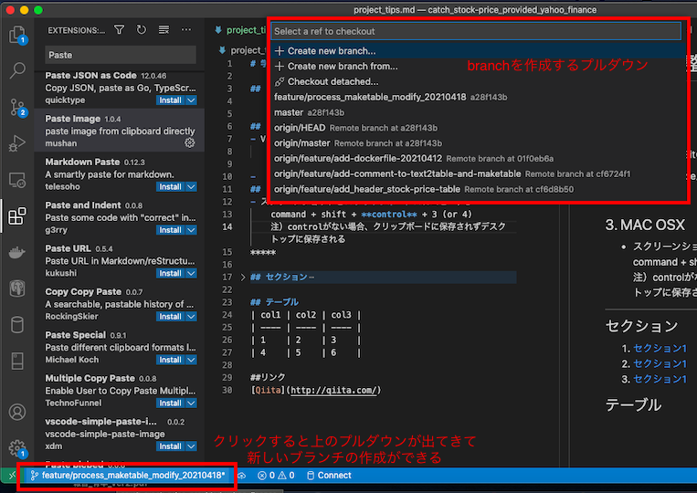
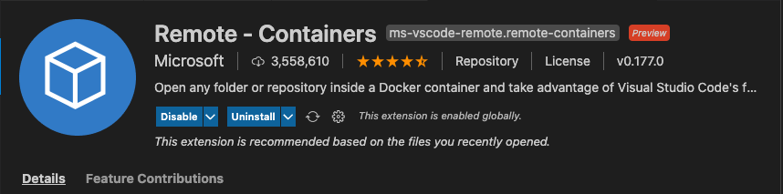
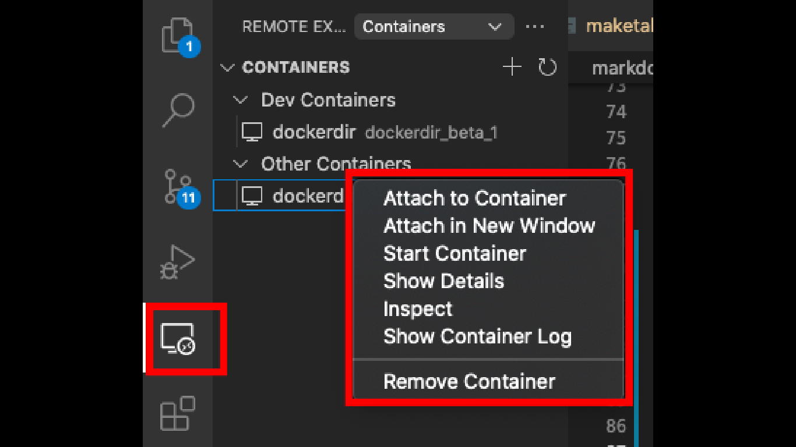

# 学習内容整理
<!-- @import "[TOC]" {cmd="toc" depthFrom=1 depthTo=6 orderedList=false} -->

<!-- code_chunk_output -->

- [学習内容整理](#学習内容整理)
  - [1. Docker](#1-docker)
  - [2. Git](#2-git)
  - [3. MAC OSX](#3-mac-osx)
  - [4. PostgreSQL](#4-postgresql)
  - [VScode](#vscode)
  - [テーブル](#テーブル)
<!-- /code_chunk_output -->


## 1. Docker
- 作成コンテナ(centOSイメージ)のデフォルト時刻はUTC
    - 設定ファイル：/etc/localtime  
    - 日本時刻に設定：ln -sf /usr/share/zoneinfo/Asia/Tokyo /etc/localtime  
        （シンボリックリンクという) 
- 容量確認を行うこと
    - 確認方法：docker system dfコマンド

    - 注意事項：  
        - volume(コンテナ内部をホスト上にマウント)は、容量を確保し、コンテナ削除しても残る
          - volume確認：docker volume ls　コマンド
          - volume削除：docker volume rm　~（volume名）　コマンド
          - volume全部削除：docker volume rm $(docker volume ls -qf dangling=true)
        - docker imageを作成した時の実行コマンドの結果がcasheされる
          - cashe削除：docker builder prune　コマンド

## 2. Git
- VSCODEとGitの連携
    - VScode上でBranchを切ることができる


  
## 3. MAC OSX
- スクリーンショットを**クリップボード**にコピーする  
    command + shift + **control** + 3 (or 4)  
    注）controlがない場合、クリップボードに保存されずデスクトップに保存される  
[参考：MACスクリーンショット](https://qiita.com/mamohacy/items/559af38aacb7a17a1600)
*****
- クリップボードコピーを貼り付ける  
  command + alt + v

## 4. PostgreSQL
- CSVファイル挿入  
  copy {Table name} from {File name/pass} with csv header  
  (ヘッダーが付いたcsvファイルのデータをテーブルに挿入する)  
  - コード例1
   ```SQL
   copy customer from 'Documents/customer.csv' with csv header
   -- header　--> ヘッダー付き
   ```

  - コード例2
  ```SQL
  copy customer(id, name) from 'Documents/customer.csv' with csv  
  -- {Table name}(columns) ：指定カラムだけ挿入する --> -->
  ```
- psqlでPostgreSQLへ接続する
  ```Bash
  psql -h "ホスト名" -p "ポート番号" -U "ロール名" -d "データベース名"
  ```
- psqlでPostgreSQLへ一時的に接続して、SQLファイルを実行する
  ```Bash
  psql -f insert_data.sql -h localhost -p 5432 -U postgres -d your_db
  ```
- 接続DB上(下記例では、DB:your_db)でCLIでクエリ実行
  ```Bash
  your_db=# \i insert_data.sql
  ```
- DBリスト、リレーションリストの確認
  ```Bash
  your_db=# \l  (DBリスト)
  your_db=# \dt (リレーションリスト)
  ```

 1. [セクション1](#link)
 2. [セクション1](#link)
 3. [セクション1](#link)

## VScode
- ### Remote-Containers - コンテナ操作をするExtension

  - 左赤枠のアイコンを選択すると、コンテナ選択画面が開き、コンテナをクリックすると  右赤枠のコンテナ操作のリストが開く

## テーブル
| col1 | col2 | col3 |
| ---- | ---- | ---- |
| 1    | 2    | 3    |
| 4    | 5    | 6    |

##リンク
[Qiita](http://qiita.com/)