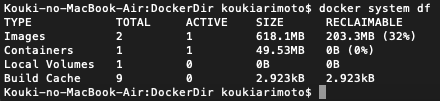

# 学習内容整理

## 1. Docker
- 作成コンテナ(centOSイメージ)のデフォルト時刻はUTC
    - 設定ファイル：/etc/localtime  
    - 日本時刻に設定：ln -sf /usr/share/zoneinfo/Asia/Tokyo /etc/localtime  
        （シンボリックリンクという) 
- 容量確認を行うこと
    - 確認方法：docker system dfコマンド

    - 注意事項：  
        - volume(コンテナ内部をホスト上にマウント)は、容量を確保し、コンテナ削除しても残る
          - volume確認：docker volume ls　コマンド
          - volume削除：docker volume rm　~（volume名）　コマンド
          - volume全部削除：docker volume rm $(docker volume ls -qf dangling=true)
        - docker imageを作成した時の実行コマンドの結果がcasheされる
          - cashe削除：docker builder prune　コマンド

## 2. Git
- VSCODEとGitの連携
    - VScode上でBranchを切ることができる


  
## 3. MAC OSX
- スクリーンショットを**クリップボード**にコピーする  
    command + shift + **control** + 3 (or 4)  
    注）controlがない場合、クリップボードに保存されずデスクトップに保存される  
[参考：MACスクリーンショット](https://qiita.com/mamohacy/items/559af38aacb7a17a1600)
*****

## 4. PostgreSQL
- CSVファイル挿入  
  copy {Table name} from {File name/pass} with csv header  
  (ヘッダーが付いたcsvファイルのデータをテーブルに挿入する)  
  - コード例1
   ```SQL
   copy customer from 'Documents/customer.csv' with csv header
   -- header　--> ヘッダー付き
   ```

  - コード例2
  ```SQL
  copy customer(id, name) from 'Documents/customer.csv' with csv  
  -- {Table name}(columns) ：指定カラムだけ挿入する --> -->
  ```
- psqlでPostgreSQLへ接続する
  ```Bash
  psql -h "ホスト名" -p "ポート番号" -U "ロール名" -d "データベース名"
  ```
- 接続DB上(下記例では、DB:your_db)でCLIでクエリ実行
  ```Bash
  your_db=# \i insert_data.sql
  ```
- DBリスト、リレーションリストの確認
  ```Bash
  your_db=# \l  (DBリスト)
  your_db=# \dt (リレーションリスト)
  ```
## セクション
1. [セクション1](#link)
2. [セクション1](#link)
3. [セクション1](#link)
   

## テーブル
| col1 | col2 | col3 |
| ---- | ---- | ---- |
| 1    | 2    | 3    |
| 4    | 5    | 6    |

##リンク
[Qiita](http://qiita.com/)